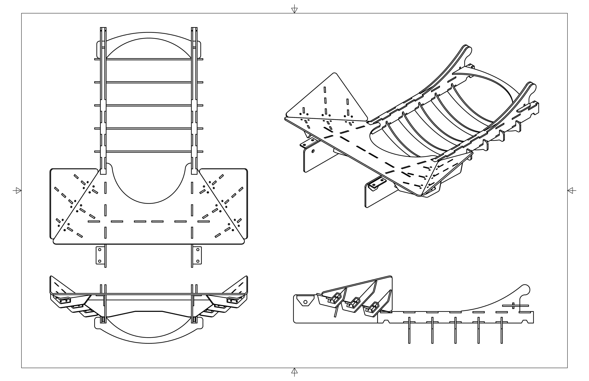
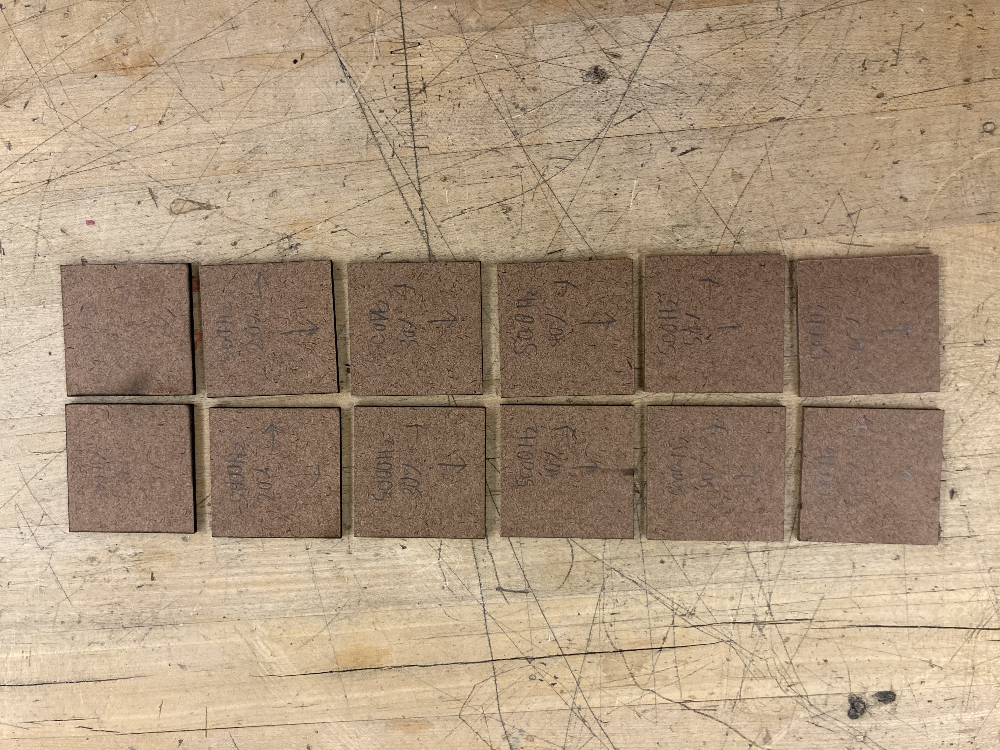
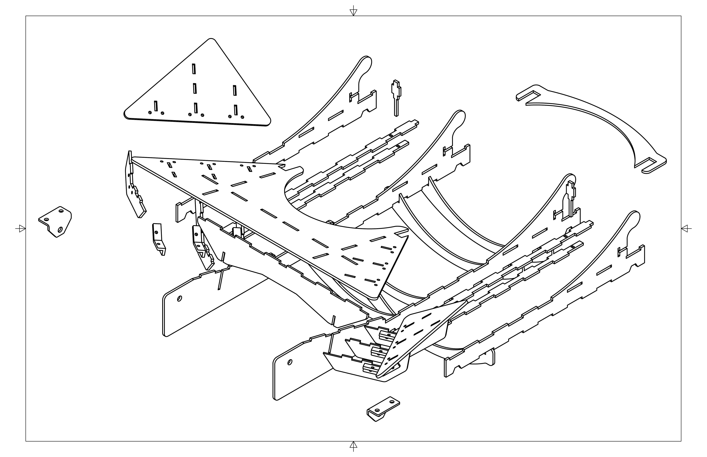
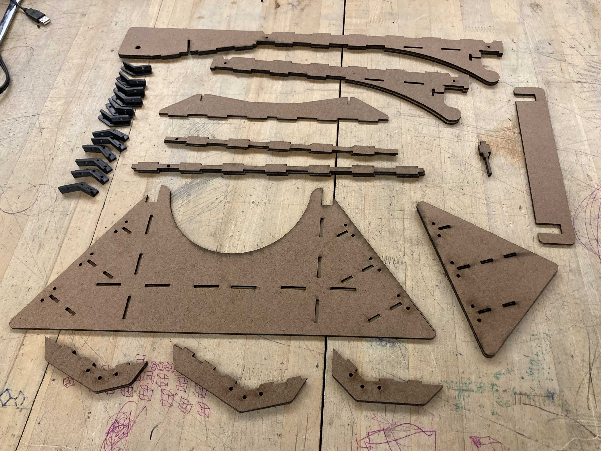
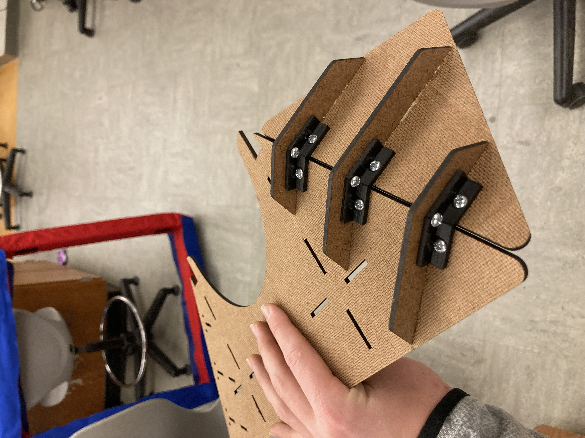
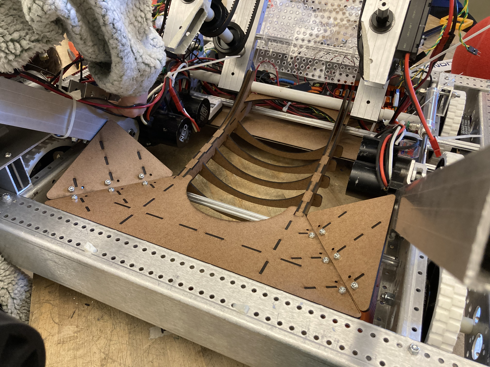
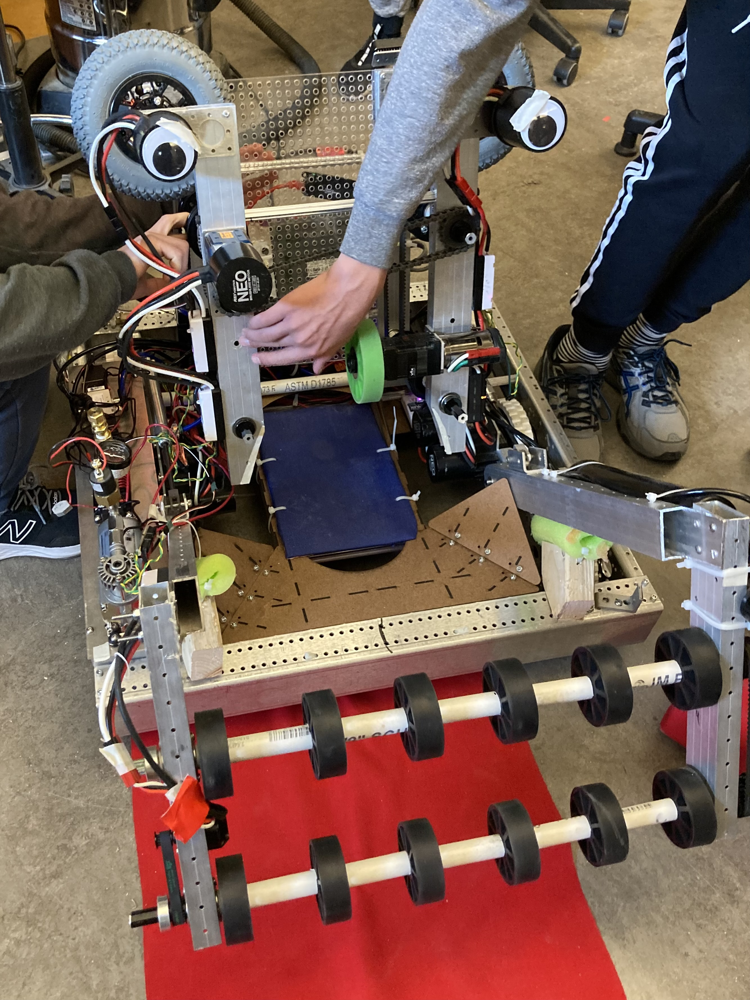

## Purpose

The goal for the 2022 FRC game was to create a robot that could gather large foam balls from the ground and launch them into a central hoop for varying amounts of points, competing against many other teams.

Our robot's overall design consisted of four main assemblies: the **chassis**, **ball intake**, **ball shooter**, and the **receiving chute**. My role on the team was to design and build the receiving chute, which funneled balls from the intake to the shooter.

## Constraints

- Must be manufactured with available tools and materials
- Must be able to survive impacts from the ball
- Must fit and fasten to the robot's existing frame
- Must not obstruct other assemblies or functions
- Must reliably guide ball from intake to shooter

## Design

Modeled in Autodesk Fusion 360.

## Machining

All structural panels are cut from 1/8" Masonite — a cheap, relatively strong, and easily machinable material. Our Epilog Zing 24 laser cutter needed extensive cleaning and setup to become fully operational, and getting consistent cuts required extensive trial and error to find settings that avoided burnt edges or incomplete cuts.

## Parts

## Assembly

Tight fitting box joints secured with wood glue provided durable and lightweight connections. Perpendicular braces were designed to prevent deflection in the main ramp and rails. The sides of the ramp were reinforced with 3D-printed brackets bolted into the ramp, its sides, and the braces.

## Integration

The chute was attached to the frame with zip-ties to avoid protruding bolt ends. The assembly engages with the frame's aluminum hex spars and aligns with the edges of the frame and intake. The ball rolls down the ramp and is guided between the two rails, which curve up into the shooter.

## Failure

During hard impacts the ball was able to knock ribs off the ramp and pry apart the rails. Horizontal spars also prevented the ball from rolling perfectly on the rails.

These design flaws were remedied by placing a flexible sheet of felt between the rails to provide elastic resistance against the ball's impact.

## Success

In competitions our robot was successful at gathering balls and scoring points, winning various rounds. Thanks to good collaboration and communication with my team, the chute was able to play its part well with the rest of the system. This process of design, construction, trial, and error provided extensive growth for my CAD and CNC machining skills, and was one of my first big collaborative engineering projects.

---

[Download maker portfolio (PDF)](/files/FRC-Robot-Chute-Maker-Portfolio.pdf)
