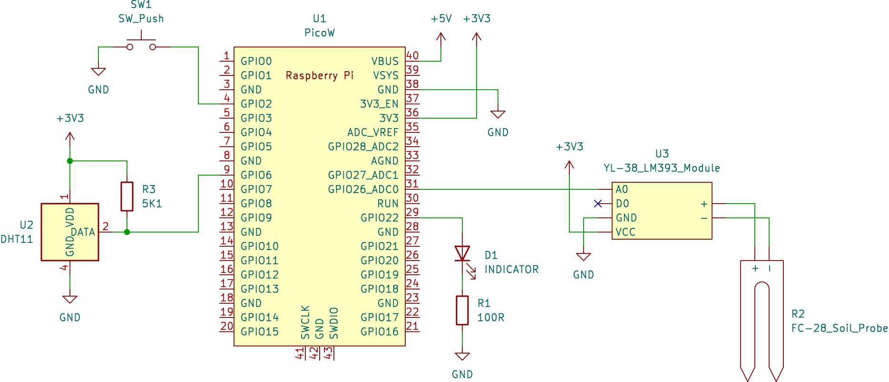

## Overview

A datalogger for my house plants running on the Raspberry Pi Pico W, written in C with the Pico SDK. It records temperature, humidity, and soil moisture every minute and indicates watering need and system health through an LED.

The project is split into eight focused modules: `wifi_mgr`, `time_sync`, `sensors`, `logging`, `storage`, `button`, `error_mgr`, and `main`. Each piece of the system (networking, timing, measurement, persistence) can be reasoned about independently.

## Sensors and readings

- **DHT11** for temperature and humidity. Readings attempt up to ten retries before giving up and waiting for the next cycle, since the DHT11 is notoriously glitchy.
- **Analog soil moisture** sensor. Each reading is averaged from 100 ADC samples to smooth noise. A soil moisture reading is only recorded when a successful DHT11 reading accompanies it.

Readings fire every minute via a repeating alarm.

## Networking and time

WiFi connects on startup. Before any NTP request the connection is verified; if down, reconnection is attempted with exponential backoff--blocking during startup, non-blocking during normal operation (the system keeps running with the last known time). NTP syncs on startup and then every 24 hours to keep the RTC accurate.

The first NTP packet in each sync event has a very short timeout because the first packet is frequently dropped; failing fast avoids a long stall before retrying.

## Calibration

Soil moisture sensors read raw capacitance, so they need calibration to percent. On startup the device enters a calibration sequence: the user first presents the sensor to dry soil (0%), then to wet soil (100%). If the two readings are too close together it prompts to try again. The calibration is stored as slope-intercept parameters and applied to all subsequent readings.

Recalibration during runtime is triggered by a 3-to-10-second button hold--useful if the sensor is moved to a different pot or soil type.

## Schematic

## LED indicator

The single red LED encodes system state at a glance:

| Pattern | Meaning |
|---|---|
| Off | Everything nominal |
| Steady on | Soil is dry -- water needed |
| ~1 Hz flash | Error: WiFi, NTP, or DHT11 needs attention |
| ~10 Hz flicker | Busy: startup init or recalibration in progress |

## Button callback / SD card conflict

This project has been on hiatus since spring 2025. This was precipitated by a particularly troublesome bug, where the SD card reader and button callback have a thus far inexplicable conflict. I intend to resume this project and either solve the problem or make a compromise/workaround.

## What's missing

Currently, while the system is capable of recording data and even storing it on the SD card, this is not exposed to the user. A natural improvement would be to send measurements to an MQTT server and database, relegating the internal storage to a backup in the event of network failure. This would lay the groundwork for real data visualizations with, for example, Grafana--or watering notifications with Home Assistant.
