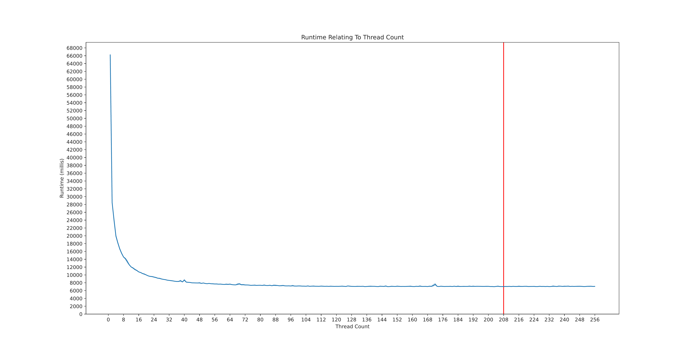
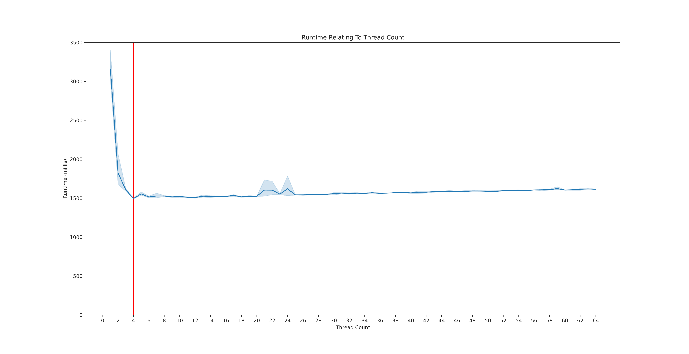

## Inspiration

The summer after quarantine started, I was on my own with not much to do, so I invented a project for myself. Two years earlier I had started learning Python in order to make games, and I wanted to expand on those skills. Looking over old scripts, I found a first iteration of a synthetic word generator that inspired this project.

## Original Synthetic Word Generator

This first program alternated random vowels and consonants to create words of random lengths. I cleaned it up to be more concise and less error-prone, and added output to a text file. Though most results were vaguely pronounceable, they didn't look English--for example, `q` appearing without `u`.

```
Jekuzedecobu
Kuqobeq
Ikidiqabonakenedo
Vipale
Efoliyihesakezane
Imiwifapekod
Yefudutize
Ugafubirojijicogu
Jodewidu
Deha
```

## Using Classic Literature

To improve the generator I needed data on what makes words sound natural. I downloaded classic novels--*Moby-Dick* and *Ulysses*--as plain text files through Project Gutenberg, and wrote a Python script to convert each book into a list of words, excluding formatting and punctuation.

## Word Frequency Comparison

I extended the parsing script to return a list of unique words with each word's count, then wrote a program to combine the word lists for two books and sort them by relative frequency. These tables show how different themes, topics, and writing styles result in divergent word choice.

**More common in *Moby-Dick*:**

| Word | MD/U | U/MD | Count |
|------|------|------|-------|
| Whale | 506.1 | 0.002 | 1246 |
| Whales | 334.0 | 0.003 | 272 |
| Sperm | 301.9 | 0.003 | 246 |
| Mast | 162.7 | 0.006 | 133 |
| Jonah | 106.0 | 0.009 | 87 |

**More common in *Ulysses*:**

| Word | MD/U | U/MD | Count |
|------|------|------|-------|
| Miss | 0.009 | 109.1 | 136 |
| Joe | 0.009 | 110.7 | 138 |
| Irish | 0.011 | 94.6 | 118 |
| Ireland | 0.014 | 72.7 | 91 |
| Bob | 0.019 | 53.3 | 67 |

## Weighted Letter Probabilities

The next iteration used letter frequencies from *Moby-Dick* to weight letter selection. Vowels and consonants still alternate, but each letter's probability is weighted by its frequency in natural text. Though these don't quite sound like English, the weighted frequencies produce many more pronounceable words.

```
Temasecos
Tita
Degiwepi
Qeresute
Rotomo
Onepulahad
Dite
Terosen
Ces
Tinafis
```

## Letter Pair Frequencies

To get better results, the program needed information on what letters usually follow other letters. Using NumPy, I wrote a program to build an array capturing the probability of each possible letter occurring after any given letter. Weighting synthesis with these probabilities resulted in more natural-sounding, if sometimes less pronounceable, words.

```
Pounesuron
Eswall
Ramasha
Darstle
Fobla
Izav
Wanu
Buspli
Rtlipi
Blyintrab
```

## Letter Combination Analysis

The final iteration uses letter triplet frequencies to pick each letter based on the preceding pair. Because certain letter combinations cannot appear at the start of words, starting letter pair frequencies are used to begin words. These are almost all pronounceable and somewhat natural sounding, with real words resulting roughly 1 in 40 times.

```
Riddilect
Harly
Cro
Spinshed
Blyne
Hobbalph
Adompti
Culatch
Squed
Bolessedgerl
```

## Multi-threaded Processing

I wanted to improve the slow runtime of the programs I had written. I learned to launch multiple threads simultaneously using Python's multiprocessing library, vastly improving performance. I tested the optimal thread count and graphed the results using Matplotlib.





## What I Learned

Throughout this project I greatly improved my skill at writing clean, concise Python and learned new libraries including NumPy and Matplotlib. I also learned a lot about using computers to create and handle large amounts of data, how to structure such data, and the basics of probability and statistics. At its core, this project was an exploration — through programming — of what makes English words sound English.

---

[Download written report (PDF)](/files/Synthetic-Word-Generator-Report.pdf)

[Download maker portfolio (PDF)](/files/Synthetic-Word-Generator-Maker-Portfolio.pdf)
