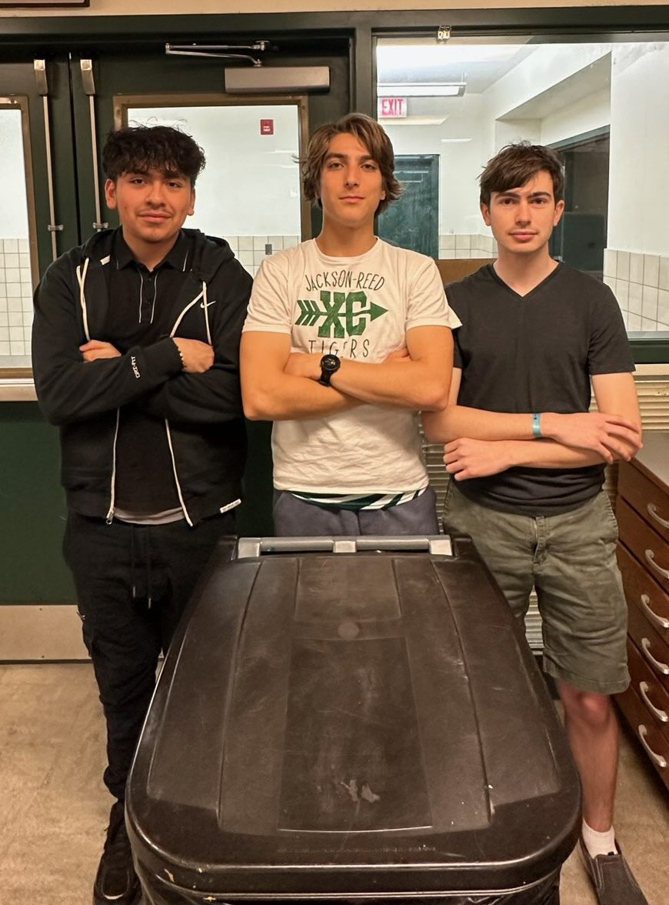
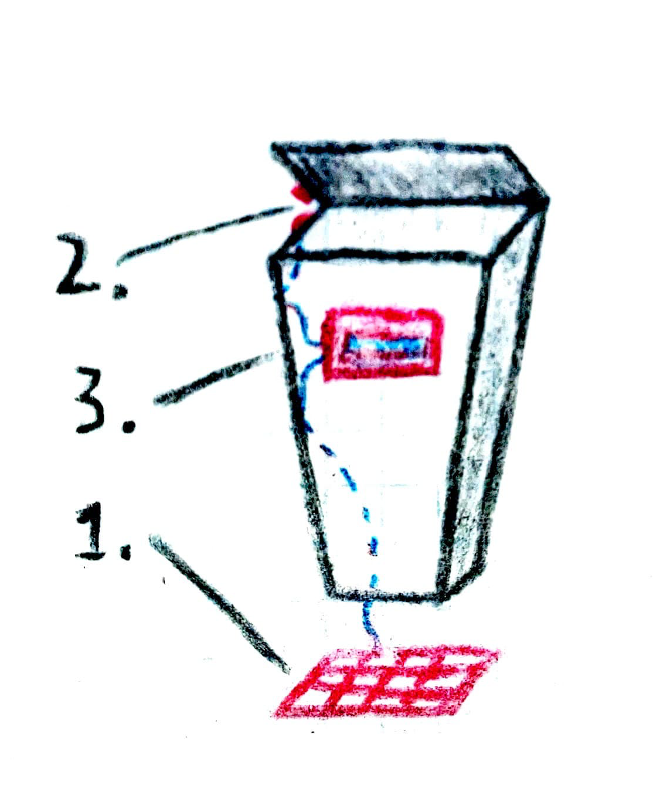
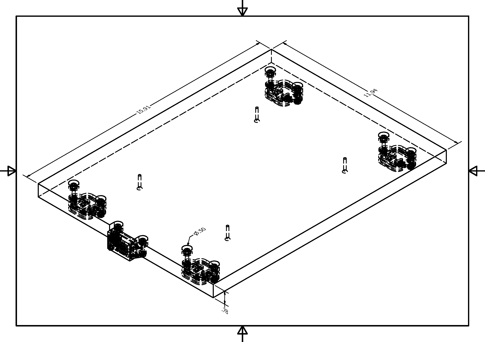
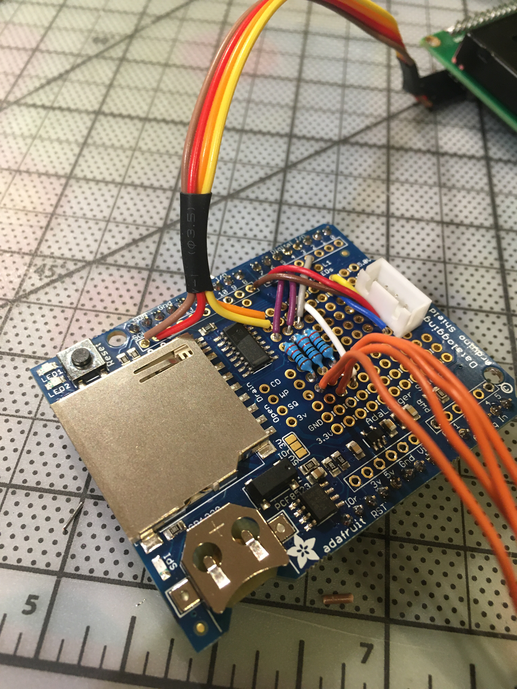
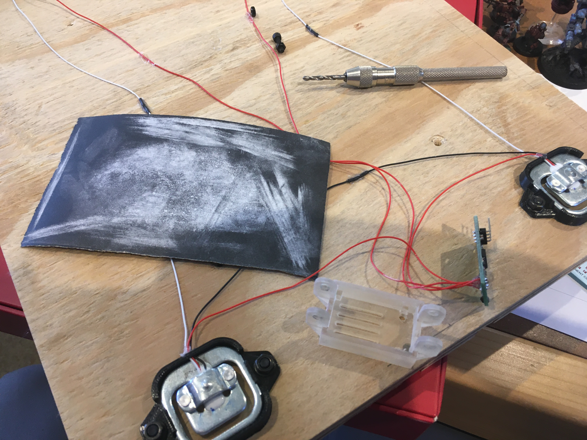
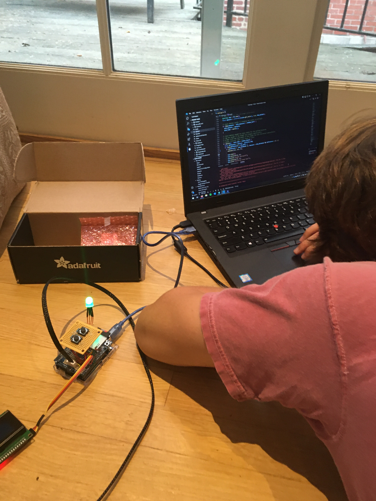
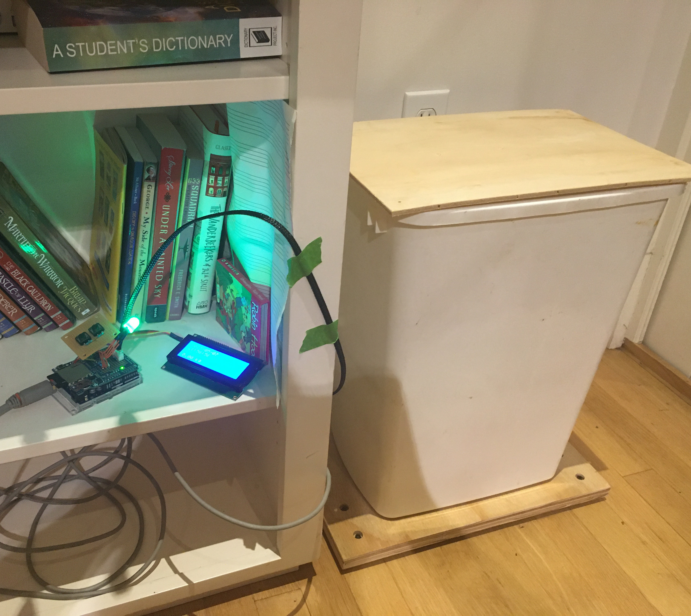
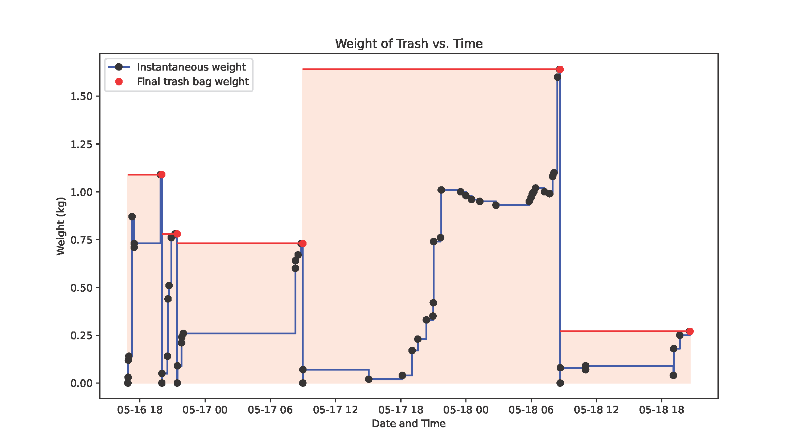

## What & why

The US generates 4.9 pounds of municipal solid waste per person per day — a record high as of 2018, and over 50% of what's properly disposed of ends up landfilled rather than recycled or composted. Reducing that footprint requires changing household habits, but habits are difficult to change without concrete feedback. Our idea was to automate the feedback loop: a scale that lives under a trash can, logs the weight continuously, and tells you how much you're throwing away without any manual effort.

This was my senior capstone project at Jackson-Reed High School, built with teammates Max Molinoff and Jonathan Benavides as part of the ST8 Honors Engineering Design & Development course. I led the project and was primarily responsible for the firmware, CAD modeling, and data analysis.

## System design

The system has two physically separate parts connected by a cable: the weighing platform and the control box.

**Platform.** A 12×16" plywood board with four 50 kg stress/strain sensors mounted underneath, wired in a Wheatstone bridge. The sensor mounting holes were drilled precisely with the school's CNC router and countersunk with a drill press so the board sits flush. FDM-printed plastic clips hold each sensor in place and provide bolt attachment points. The HX711 amplifier board — which combines the four sensor signals into a single readable output — mounts to the side of the board via a custom resin-printed bracket that took several iterations to get right. Its countersink slots extend to the board edge so the mount can slide on flush without clearance issues. Sensor wires run along the underside secured with hot glue.

**Control box.** An Arduino UNO WiFi Rev2 stacked with an Adafruit Data Logger Shield, which combines an SD card reader, PCF8523 real-time clock, and prototyping area into one board. Soldered to the prototyping area: a 4-pin JST-XH connector to the platform cable, a 20×4 I²C LCD panel, and an RGB status LED. The two Yes/No input buttons live on a separate small prototype board due to space constraints. Everything is wired with extended leads for placement flexibility. The Arduino WiFi Rev2 was chosen specifically for its latent WiFi capability — useful for a future IoT version that could push data directly to a phone rather than requiring the SD card to be physically removed.

The firmware is written in C++ with PlatformIO. Key behaviors:

**Stability detection.** A reading is only logged when the weight has changed by more than 20 g from the previous log *and* has stayed within 10 g of its new value for 5 continuous seconds. This prevents partial readings while the can is being loaded and lets the user deposit multiple items before a new value is committed.

**Bag detection.** If the weight drops by more than 100 g, the system prompts the user to confirm whether the bag was replaced. If yes, the pre-emptying weight is written to a separate `bags.csv` and the scale re-tares against the empty can. If no, the change is logged as a regular weight update.

**Persistent tare.** The tare offset is stored in EEPROM so it survives power cycles without needing a new calibration ceremony on every startup.

**Graceful startup.** If the RTC has lost power, the firmware resets time to the compile timestamp and prompts for confirmation before continuing. The SD card init loops with a user-visible error message rather than silently failing if the card is missing.

**LED status.** Red during startup until all components are verified, yellow while the weight is unsettled or a prompt is waiting, green when the system is logging nominally.

One earlier design element that was cut: the original concept included a third component — a lid or door sensor that would detect when trash was deposited. It was dropped because the variation in trash can openings made a universal design impractical, and constant weight polling turned out to be a sufficient substitute.

## Build notes

Early testing was derailed by two compounding failures. A loose solder joint on the button board caused false button presses that triggered spurious tares without any user input. At the same time, a logic bug in the bag-detection code treated any weight decrease when the total was low as a bag event. The two problems together meant the system spent most of its time stuck on prompts or taring and logging bags in rapid succession. This rendered the first round of data collection (May 7–10) essentially useless.

Both issues were found and fixed — the joint reinforced with hot glue, the detection logic corrected — and the system ran reliably after that. A separate usability problem surfaced during the final test: the LCD backlight and RGB indicator glow around the clock, which the test household found aggravating at night. Dimming them after a timeout was on the to-do list but didn't make it before the deadline.

## Results

The final test run ran three days (May 16–18) at a team member's home, using a small dustbin loaded with paper waste to simulate trash disposal in a controlled way. Items were added from a bag at irregular intervals; the can was periodically emptied back into the bag to simulate a bag replacement event. Five bag events were logged totaling 4.51 kg. A short Python/matplotlib script processed the raw CSVs and rendered a weight-over-time graph with bag events highlighted as shaded intervals.

The system did what it was supposed to: it logged weight changes automatically, detected bag replacements, and produced structured data without any manual input. The main caveat is that this was simulated use over three days, which was too short and too controlled to say anything meaningful about actual habit change.

## Reflection

This was the first project where I designed components specifically for fabrication — some for FDM printing, one for resin printing — and modeled the full mechanical assembly in Inventor before building. Getting the HX711 mount to work required understanding how the board's hole pattern and connector placement constrained the bracket geometry, which meant iterating the model alongside the physical prototype rather than getting it right the first time.

The firmware patterns here — polling for stability before committing a reading, using EEPROM to survive power loss, surfacing hardware errors to the user rather than failing silently — are things I've reached for in later embedded work. The debugging process also made a lasting impression: both of the major failures were rooted in the physical assembly and completely invisible from software alone.

The report's conclusion framed the honest trade-off well: the prototype proved the concept works, but at the cost and complexity of a hand-built prototype it's not yet better than a bathroom scale and a spreadsheet. The path to something genuinely useful would be WiFi data offload, a mobile companion app, and integrating the electronics directly into the platform to eliminate the control box entirely.

---

[Download written report (PDF)](/files/Digital-Waste-Management-Written-Report.pdf)

[Download presentation (PDF)](/files/Digital-Waste-Management-Presentation.pdf)
